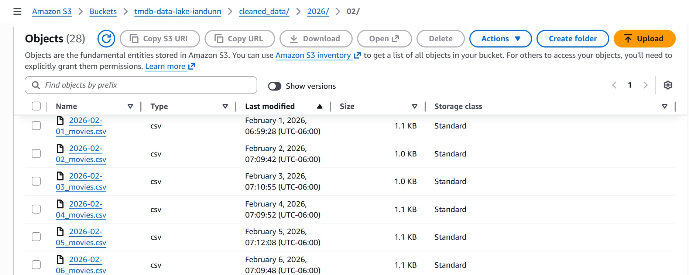

# Movie Trend Data Lake

A fully automated ETL pipeline that tracks daily movie trends. This project leverages **GitHub Actions** as a compute engine to extract data from the **TMDB API**, transform it using **Pandas**, and load it into a secure **AWS S3 Data Lake**.



## Project Overview

This repository acts as a self-updating database of movie trends. Instead of paying for cloud servers, it uses GitHub Actions to run a daily cron job that:
1.  **Extracts:** Fetches the daily trending movies from the The Movie Database (TMDB) API.
2.  **Transforms:** Cleans the JSON response, adds timestamping, and standardizes the schema using Pandas.
3.  **Loads:** Uploads the cleaned data to AWS S3 using monthly partitioning (`year/month/`) for optimized storage and retrieval.
4.  **Reports:** Generates a markdown snapshot (`LATEST_UPDATE.md`) and commits it to the repository dashboard, while keeping the data isolated in the cloud.

## File Structure

* `etl.py`: The core Python script that performs the Extract, Transform, and Load logic.
* `.github/workflows/scheduler.yml`: The YAML configuration for the GitHub Actions runner. It manages secrets and schedules the job to run daily at 12:00 UTC.
* `tests/`: Unit tests ensuring data transformation logic is accurate before upload.
* `LATEST_UPDATE.md`: A generated Markdown report showing the top 5 movies from the most recent run.
* `(External) AWS S3 Bucket`: Stores the historical data, partitioned as `cleaned_data/YYYY/MM/YYYY-MM-DD_movies.parquet`.

## Tech Stack

* **Language:** Python 3.9
* **Libraries:** Pandas, Requests, Boto3, Pytest
* **Cloud Storage:** AWS S3
* **Orchestration:** GitHub Actions (Cron Scheduler)
* **Data Source:** TMDB API

## How It Works

### 1. The ETL Script (`etl.py`)
The script extracts raw data from TMDB and processes it into a structured DataFrame. Instead of appending to a local file, it establishes a connection to AWS using Boto3. It implements idempotent writes, meaning it saves each day's data as a unique object in S3 organized by Year and Month. This ensures that re-running the script simply updates the specific day's file without duplicating data or corrupting historical records.

### 2. The Scheduler (`scheduler.yml`)
The pipeline is defined as code using YAML. It sets up an Ubuntu container, installs dependencies, and injects both API keys and AWS IAM Credentials securely via GitHub Secrets. It enforces a "Least Privilege" security model by using a dedicated IAM user with scoped S3 access.

```yaml
on:
  schedule:
    - cron: '0 12 * * *' # Runs every day at 12:00 PM UTC
